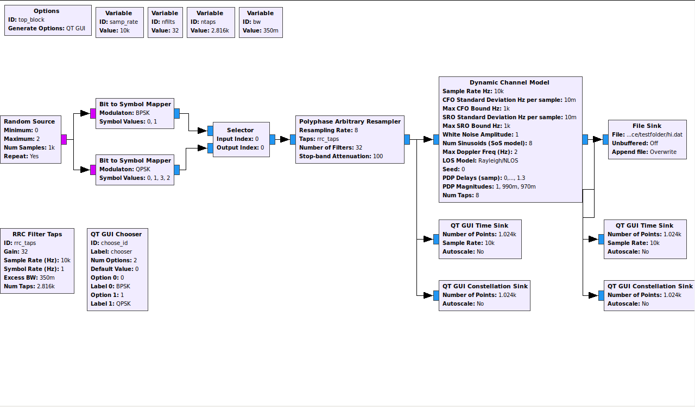
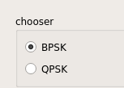

# GRC를 이용한 실시간 MODULATION 분류 시각화

## **<center> 전체적인 그림</center>**



*<center>Basic Tool</center>*

첫번째 초안을 잡을 때 grc를 나타낸 그림이다.

Random Source를 통해 실시간으로 신호를 새성하여 Mapper를 통해 Modulation과정을 진행한다.  
그 후, selector를 통해 원하는 신호를 선택하고 time sink와 constellation sink를 통해 gui를 나타낸다.

또한, selector를 통한 신호는 Channel Model을 지나게 된 것을 time sink와  constellation sink를 통해 gui를 나타낸다.


<br>

* ### Random Source

난수를 생성하는 block이다.  
min과 max를 선택 후 반복적으로 난수를 생성한다.
min = 0, max = 2를 선택할 시, 0100101...와 같은 sequence가 생성된다.

```python
self.analog_random_source_x_0 = blocks.vector_source_b(map(int, numpy.random.randint(0, 2, 1000)), True)
```
<center>Random Source Python code</center>
</br>

* ### Bit to Symbol Mapper

bit를 symbol로 mapping 시켜주는 block이다.
QPSK로 mapping을 시키는 방식은 다음과 같다.
01001011...이라는 sequence가 들어온다고 가정하자.
각각의 신호를 01 / 00 / 10 / 11 로 나누어 각각 1 / 0 / 2 / 3으로 symbol이 생성된다. 

```python
self.QPSK = mapper.mapper(mapper.QPSK, ([0,1,3,2]))
self.BPSK = mapper.mapper(mapper.BPSK, ([0,1]))
```
<center>Bit to Symbol Mapper Python code</center>

</br>

* ### Selector & Chooser

Selector는 여러가지 input중에 원하는 것을 선택하여 output으로 내보낼 수 있는 block이다.
input의 갯수와 output의 갯수를 자신이 필요한 만큼 설정을 해준다.  
input index와 output index를 설정하는 부분이 있는데, 이 부분은 입/출력 stream을 선택하는데 보통 QT GUI Chooser를 사용하여 실시간으로 변경을 한다.

Chooser는 내가 원하는 label을 선택할 수 있다.
Chooser에서 선택된 label에는 각각 option에 대한 값이 들어가 있는데, 이 값이 selector로 입력되는 것이다.  
마지막으로 qt gui chooser와 selector를 연결하기 위해서는   
**selector의 input index부분에 chooser의 id값을 입력해주면 연결**  
되는 것을 알 수 있다.


```python
        self._choose_id_options = (0, 1, )
        self._choose_id_labels = ('BPSK', 'QPSK', )

        # id option과 label이 각각 연결되는 것이다.
        self._choose_id_group_box = Qt.QGroupBox('chooser')
        self._choose_id_box = Qt.QVBoxLayout()

        # group box는 아래 사진처럼 선택창의 이름을 선택하는 부분이다.
```



```python
        class variable_chooser_button_group(Qt.QButtonGroup):
            def __init__(self, parent=None):
                Qt.QButtonGroup.__init__(self, parent)
            @pyqtSlot(int)
            def updateButtonChecked(self, button_id):
                self.button(button_id).setChecked(True)
                # Radio Button을 누르게 되면 이 부분이 계속 적으로 바뀌는 것을 알 수 있다.
                # 바뀌는 부분을 확인화기 위해서는 print(button_id)를 통해 버튼을 누를 때 마다 Chooser의 option값들이 계속적으로 변화하여 나타나는 것을 알 수 있다.
        self._choose_id_button_group = variable_chooser_button_group()
        self._choose_id_group_box.setLayout(self._choose_id_box)


    def get_choose_id(self):
        return self.choose_id

    def set_choose_id(self, choose_id):
        self.choose_id = choose_id
        self._choose_id_callback(self.choose_id)
        self.selector.set_input_index(int(self.choose_id))

        # radio button을 누르면서 계속 바뀐 choose_id 값이 get_choose_id를통해 set_choose_id에서 값을 바꿔주는 과정이다.

```

```python
        for i, label in enumerate(self._choose_id_labels):
        	radio_button = Qt.QRadioButton(label)
        	self._choose_id_box.addWidget(radio_button)
        	self._choose_id_button_group.addButton(radio_button, i)
        self._choose_id_callback = lambda i: Qt.QMetaObject.invokeMethod(self._choose_id_button_group, "updateButtonChecked", Qt.Q_ARG("int", self._choose_id_options.index(i)))
        # 이부분이 버튼을  클릭할 때마다 변하는 부분이지만, QT에 때한 프로그램을 알아야 하기 때문에 정확하게는 모르겠다....
        self._choose_id_callback(self.choose_id)
        self._choose_id_button_group.buttonClicked[int].connect(
        	lambda i: self.set_choose_id(self._choose_id_options[i]))
        self.top_layout.addWidget(self._choose_id_group_box)

```
<center>Chooser Python code</center>

```python
        
        self.selector = grc_blks2.selector(
        	item_size=gr.sizeof_gr_complex*1,
        	num_inputs=2,
        	num_outputs=1,
        	input_index=choose_id,
        	output_index=0,
        )
        
```
<center>Selector Python code</center>  

selector에 대한 코드를 나타내는 것이다.
input과 output의 갯수를 설정하고 input index를 choose_id로 설정하는 것을 알 수 있다.

