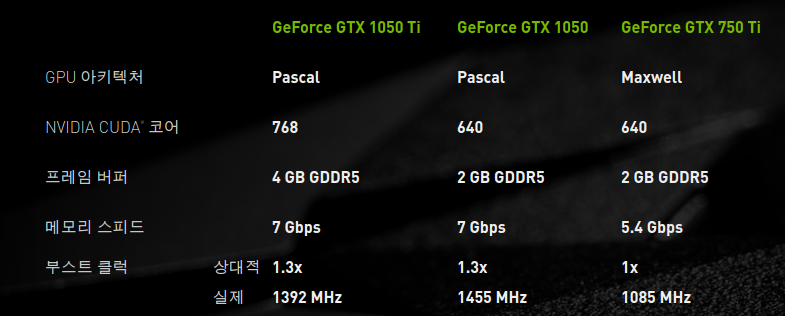
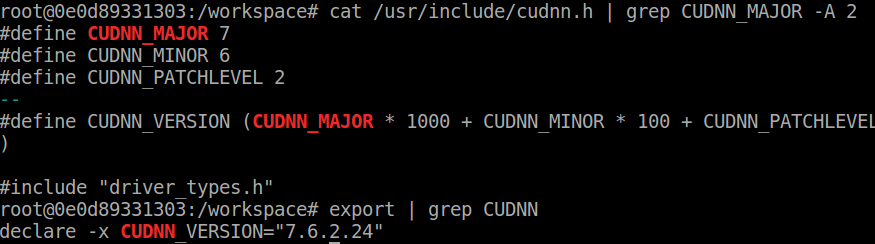
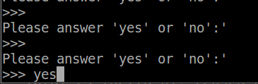
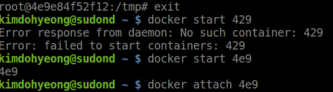

# RadioML을 이용하기 전 환경설정 하기

* **참고로 이번 환경설정편에서는 docker의 설치는 되어 있다고 가정하고 진행하는 것이다.**
* **docker는 19.03버전 이상으로 진행했으며 따로 nvidia-docker 설치과정을 진행하지 않았다.**

## 1. TensorRT image Pull

가장 먼저 진행하게 된 일은 Tensorrt Image Pull이다.<br>
그런데 이 TensorRT는 무엇인데 image를 Pull하는 것일까?<br>

우리는 docker라는 container안에서 작업을 진행하기 때문에 작업을 진행하려면 하나부터 설치를 직접 해야한다.<br>
하지만 CUDA, CUDNN들은 직접 설치하는 과정이 까다롭고 각자의 환경에 따라 많이 다르기 때문에 많은 시행착오를 거쳐야한다<br>

그래서 Ubuntu, Cuda, Cudnn 등 다양한 패키지들이 미리 설치되어 있는 이미지를 이용해서 작업을 진행하기로 결정을 하였다.<br>

그 중에서 가장 먼저 알아야 할 것은 자신의 Hardware의 정보를 알아야 한다.<br>
내 컴퓨터는 GTX1050이라서 성능을 찾아보면 다음과 같이 pascal로 나온다.<br>


*<center>GTX 1050 PASCAL</center>*

그리고 Ubuntu:16.04 version을 이용하기를 원했기 때문에 다음을 이용하였다.


*<center>architecture_check</center>*

이는 다음 사이트를 참고하면 된다.

참고 사이트 : <https://docs.nvidia.com/deeplearning/frameworks/support-matrix/index.html#framework-matrix>

다음 사이트는 내가 사용하려는 image의 정보를 확인할 수 있다.

참고 사이트 : <https://docs.nvidia.com/deeplearning/sdk/tensorrt-container-release-notes/rel_19-08.html#rel_19-08>

그래서 나는 **tensorrt-19.08**버전을 선택하였다.

TensorRT Image를 pull하기 위한 명령어는 다음과 같다.
```python
docker pull nvcr.io/nvidia/tensorrt:19.08-py3
#docker pull nvcr.io/nvidiatensorrt:<tensorrt_version>-<python_version>
```

다음은 docker container를 실행시키기 위해서는 옵션을 주어야 한다.<br>
그리고 gpu를 사용할 것이기 때문에 **--gpus all** 옵션을 주어야 한다.<br>
만약 gpu를 1개를 선택하고 싶으면 **--gpus <번호>** 해당 번호를 선택해서 옵션을 설정해주면 된다.<br>

참고로 나는 docker 19.03버전 이상이기 때문에 nvidia-docker를 따로 설치하지 않았다.<br>
*하지만 nvidia-docker처럼 사용하기 위해서는 nvidia-container-toolkit을 설치하는 과정을 거쳐야한다.*

```python
docker run --gpus all -it nvcr.io/nvidia/tensorrt:19.08-py3
```
만약 gpu 옵션을 주지 않는다면 다음과 같이 gpu를 사용할 수 없다는 warning을 준다.


*<center>architecture_check</center>*

## 2. python, cuda, cudnn 버전 확인하기

* python version 확인
  ```
  # python -V
  ```
  
*<center>python_version_check</center>*
* CUDA version 확인
  ```
  # export | grep CUDA
  # nvcc --version
  ```
 
*<center>cuda_version_check</center>*
* CUDNN version 확인
  ```
  # cat /usr/include/cudnn.h | grep CUDNN_MAJOR -A 2
  # export | grep CUDNN
  ```
 
*<center>cudnn_version_check</center>*

## 3. Image Commit하기

docker환경에서 gui를 이용하기 위해서는 x2goclient를 설치를 해야한다.<br>
또한, gui를 사용하기 위해서는 docker container를 생성할 때 옵션 설정을 해야하므로 commit을 해서 image를 생성한다.<br>
이러한 image를 이용해서 container를 만드는 과정을 진행하면 된다.<br>

Commit을 하는 명령어는 다음과 같다.<br>
**commit을 하는 과정은 새로운 터미널을 켜고 container는 실행시킨 상황에서 진행을 해야한다.**

#### docker commit <컨테이너 이름> <docker hub 아이디>/<내가원하는 image이름>

```python
$ docker commit crazy_bubble sudond/tensorrt:19.08-py03
```
<br> 
참고로 docker container의 이름을 확인하기 위해서의 명령어는 다음과 같다.<br>

```
docker ps -a
```
<br>

> 여기부터는 참고사항이다.<br>
> image를 push하기 위해서는 다음과 같은 작업을 진행한다
> ```
> $ docker push sudond/tensorrt:19.08-py3
> $ docker search sudond/tensorrt:19.08-py3
> ```
> search 하는 과정은 이미지를 docker hub에 올라가 있어도 찾는데는 시간이 걸린다.<br>
> 하지만 pull은 바로 진행할 수 있다.
> 참고 : pull하는 과정 : docker pull <해당 이미지 이름>
> 

## 4. Commit한 image로 새로운 contianer 생성하기

새로운 container를 생성하기 전에 x2goclient를 이용해야 하기 때문에 옵션을 다음과 같이 설정한다.<br>
```
docker run --gpus all -it -v /tmp/.X11-unix:/tmp/.X11-unix -v /dev/snd:/dev/snd -e DISPLAY=unix$DISPLAY sudond/tensorrt:19.08-py3
```
**--gpus all**을 제외한 옵션을은 x2goclient의 gui를 이용하기 위한 옵션들이다.<br>
그리고 **--gpus all**을 사용하지 않는다면 gpu를 사용할 수 없기 때문에 반드시 옵션을 설정해주어야 한다.<br>


## 6. Conda 설치하기

나중에 RadioML을 사용할 때 theano를 이용하기 때문에 이에 관련된 패키지를 쉽게 설치하기 위해서 conda를 사용하면 편리하기 때문에 conda를 이용한다.

* https://www.anaconda.com/distribution/사이트를 통해서 최신버전 bash 스크립트를 	복사해 놓는다.<br>
  참고로 bash script는 잘 찾아봐야한다. 난 잘 모른다 흐흐흐
* anaconda 설치 파일 다운로드
  $ cd /tmp<br>
  $ curl -O  curl -O https://repo.anaconda.com/archive/Anaconda3-5.2.0-Linux-x86_64.sh

*  verify the file integrity the sha256sum command<br>
  $ sha256sum  Anaconda3-5.2.0-Linux-x86_64.sh
  <br>
* 설치 스크립트를 실행하고 ENTER 입력으로 설치 계속<br>
  $ bash Anaconda3-5.2.0-Linux-x86_64.sh
  <br>
  *<center>Enter 계속 누르기</center>*<br>
  <br>
  *<center>라이센스 동의 질문 : yes 입력</center>*<br>
  <br>
  *<center>설치 경로 확인</center>*<br>
  <br>
  *<center>bashrc에 경로 추가 : yes </center>*<br>
  <br>
  *<center>vscode 설치 : no </center>*<br>
  
  참고로 vscode설치는 자유롭게 해도된다.

* 터미널 재시작<br>
  docker 환경에서 진행했으므로 docker를 껐다가 다시 시작한다.<br>
  
  *<center>docker 재시작 </center>*
* bashrc 추가 후 버전확인
  
  *<center>vscode 설치 : no </center>*
* update!!
  ```
  conda update conda
  ```
참고로 conda를 업데이트 했으면 껐다가 다시 켜야 (base)환경으로 들어가게 된다.<br>

참고한 사이트 : <https://nagy.tistory.com/26>

## 7. conda 가상환경 만들기

docker 내부에 conda 가상환경 안에서 작업을 진행하고 싶으면 다음과 같은 과정을 거치면 된다.<br>
가상환경 상황은 다음과 같이 나오게 된다.
```
(base) root@4e9e84f52f12:/workspace# 
```

가상환경을 만드는 방법은 다음과 같다.<br>
나는 python3.7버전과 tensorflow 1.14버전의 conda 가상환경을 설치할 것이므로 가상환경 이름을 py37tf114로 한다.
```
conda create --name py37tf114 python=3.7
```
가상환경 생성이 완료되면 다음과 같은 명령을 친다.

```
(base) root@4e9e84f52f12:/workspace# conda activate py37tf114
(py37tf114) root@4e9e84f52f12:/workspace# 
```

이제 괄호의 내용이 바뀌는데, 다른 가상환경 안으로 들어가게 된 것이다.<br>

내가 설치한 conda의 가상환경을 확인하고 싶으면 다음 명령어를 확인해라.

```
(py37tf114) root@4e9e84f52f12:/workspace# conda env list     
# conda environments:
#
base                     /root/anaconda3
py37tf114             *  /root/anaconda3/envs/py37tf114
```

## 8. 필요한 패키지 설치

가장 먼저 tensorflow를 설치해야 하는데 gpu를 이용해야 하기 때문에 gpu버전을 설치한다.<br>
keras도 설치를 진행해야 하므로 다음과 같이 진행한다.

```
pip install tensorflow-gpu==1.14
pip install --upgrade keras 
```

설치된 tensorflow와 keras를 확인하기 위해서는 list를 이용한다.
```
(py37tf114) root@4e9e84f52f12:/workspace# pip list | grep Keras     
Keras                2.3.1              
Keras-Applications   1.0.8              
Keras-Preprocessing  1.1.0              
(py37tf114) root@4e9e84f52f12:/workspace# pip list | grep tensorflow
tensorflow-estimator 1.14.0             
tensorflow-gpu       1.14.0  
```

> 참고로 tensorflow를 import할 때 numpy version에러가 난다.<br>
> 이 에러는 version을 낮추면 되기 때문에 다음과 같이 해결할 수 있다.
> ```
> (py37tf114)pip show numpy 
> (py37tf114)conda uninstall numpy 
> (py37tf114)conda install numpy==1.16.5 
> ```
> 이제 numpy 에러가 해결된다!.

딥러닝과 관련된 추가적인 python package들을 추가적으로 설치한다.

```
(py37tf114) root@4e9e84f52f12:/workspace# pip install jupyter theano keras matplotlib scikit_learn seaborn
(py37tf114) conda install pygpu
(py37tf114) conda install theano
```