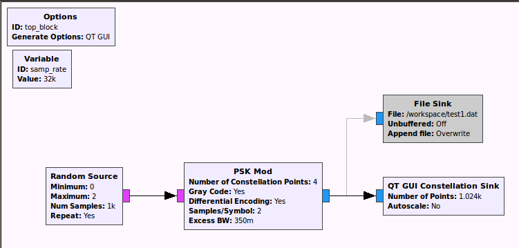
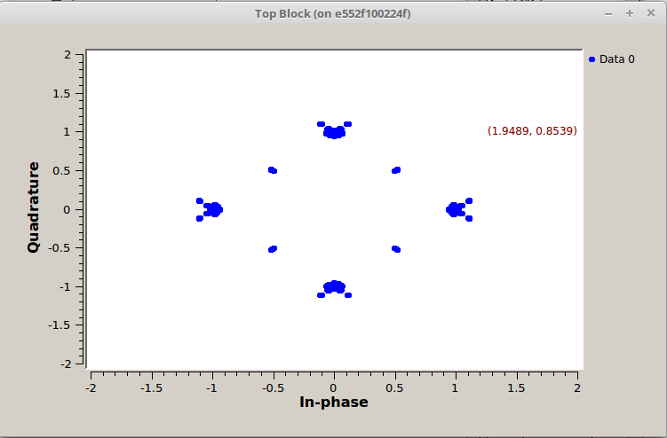
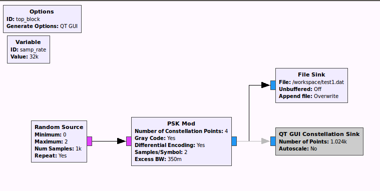
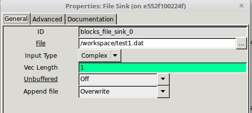
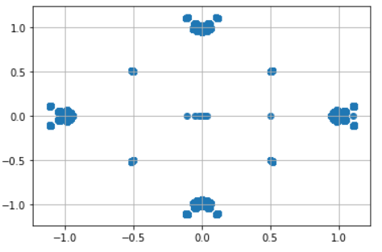

# GNURadio에서 Binary file 읽기

## GNURadio에서 QPSK 데이터 생성하기 

GNURadio상에서 QPSK데이터를 생성한다.

* Random Source를 이용하여 데이터 생성
* QPKS Modulation 진행
* QT GUI Constellation을 이용한 그래프 완성



*<center> QPSK Graph </center>*


*<center> QPSK Result </center>*


## GNURadio에서 QPSK 데이터 저장하기


데이터를 생성하는 과정을 눈으로도 확인했으니 저장하는 과정을 진행한다. <br>
내가 만들어낸 데이터를 다양한 프로그래밍 환경에서 읽을 수 있도록 만들기 위해서 binary 파일을 만든다.<br>

이 과정을 진행하기 위해서 GNURadio에 있는 file sink Block을 이용한다.<br> 
이 Block은 GNURadio 내에서 만들어진 데이터들을 binary 형태로 파일을 저장하고 이진 파일은 IQIQIQ...순서로 float32로 채워지게 된다.



*<center> file sink block </center>*



*<center> file sink property </center>*

* FIle : 데이터가 binary 형태로 저장될 경로 작성
* Unbuffered : 출력이 메모리에 버퍼링되는지 여부 지정
* Append file : 매번 새로운 파일을 만들지 추가할 지를 선택

## 저장된 데이터 불러오기

file sink로 만들어낸 데이터를 읽어오기만 하면된다.

```python
f = scipy.fromfile(open("filename"), dtype=scipy.uint8)
```

다음 코드는 내가 저장한 파일을 numpy배열로 데이터를 받아오는 과정이다.

마지막 dtype은 data type을 원하는 것으로 바꿔서 설정하는 부분이다.

다음 코드는 내가 생성한 binary 파일을 직접 불러와서 jupyter notebook으로 돌려본 코드이다.
```python

save_file = scipy.fromfile(open("/workspace/test1.dat"), dtype=scipy.float32)
# open을 할 때는 경로도 모두 적어주어야 한다.

print(type(save_file))
print(save_file.shape)

saved_I_data = []
saved_Q_data = []

# I/Q데이터는 순서대로 저장되기 때문에 다음 코드를 작성해준다
# 즉, save_file에 IQIQIQIQ...순서로 값들이 저장된다
for i, v in enumerate(f_[:50000]):    
    if i % 2 == 0:
        x__.append(v)    
    else:
        y__.append(v)
            
            
print(len(x__)) # 25000
print(len(y__)) # 25000
```
*<center> data save code </center>*

```python
import matplotlib.pyplot as plt

plt.scatter(x__,y__)
plt.grid(b=True)
plt.show()
```
*<center> plot code </center>*

*<center> jupyter_notebook_QPSK </center>*

참고한 사이트 : <https://wiki.gnuradio.org/index.php/FAQ#What_is_the_file_format_of_a_file_sink.3F_How_can_I_read_files_produced_by_a_file_sink.3F>

ctrl + f 를 눌러서 (how can i read files)을 검색한다.