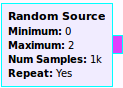
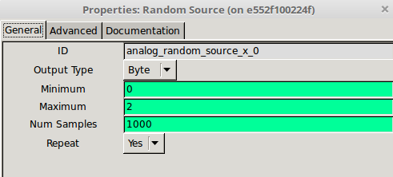
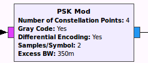
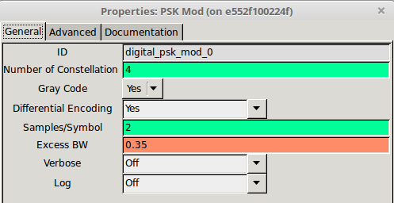
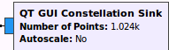
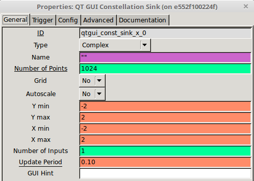
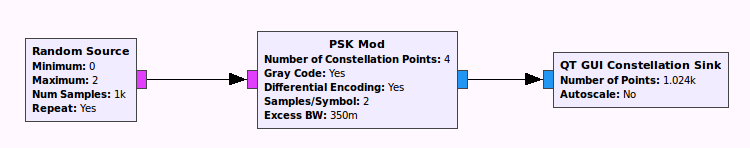
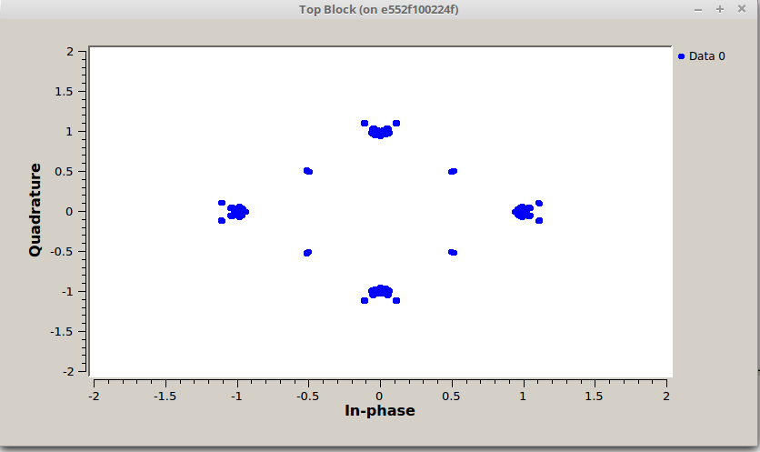

# GUNRadio에서 생성된 데이터 사용하기

## GNURadio에서 생성된 데이터 가져오기

### GNURadio Block

* Raodom_Source_block  
  
  *
Raodom_Source_block & Random_Source_Properties
* 

  [min,max)범위의 수많은 random sample을 생성하는 block이다.  

  만약 Minimum = 0, Maximum =2 이면 이에 해당하는 random source block이 생성하는 값들은 010010100... 값으로 랜덤하게 값이 들어간다.

* PSK_Mod_Block
  
  
   
  *
psk_mod_block & psk_mod_properties
*

  psk modulation은 디지털 데이터를 전송하는 방식으로 BPSK,QPSK,8PSK 등이 존재한다. 
  number of Constellation :  
  Samples/Symbol : 
  하나의 Symbol에 몇개의 sample이 들어갈 지를 정하는 곳이다. 
* QT_GUI_constellation

*
QT_GUI_constellation_block & QT_GUI_constellation_properties
*

QT_GUI block은 GNURadio flowgraph에 다양한 QT기반 그래픽 사용자 인터페이스 블록이 포함되어 있다.  
그 중에서 Constellation sink는 Real값과 Imaginary값을 극좌표 형태로 그려주는 역할을 한다.  

*
데이터를 QPSK를 통과하는 블록생성 과정
*

실행을 시키기 위해서는 **F5**을 눌러서 파일을 저장을 한다.  
다음으로 파일을 실행시키기 위해서 **F6**을 누른다. 

*
QPSK plot
*

