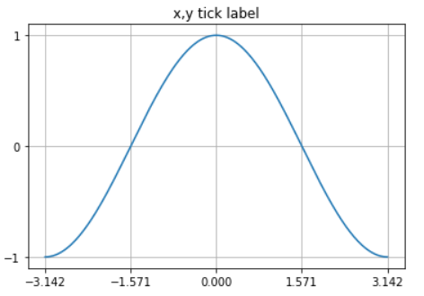

# scatter를 이용한 데이터 표현
## matplotlib 이용하기


 ### MatPlotlib이란
> Matplotlib는 파이썬에서 자료를 차트(chart)나 플롯(plot)으로 시각화(visulaization)하는 패키지이다

(참고사이트 : <https://datascienceschool.net/view-notebook/d0b1637803754bb083b5722c9f2209d0/>)

Matplotlib패키지에는 pylab이라는 서브패키지가 존재한다.  
간단한 시각화 프로그램을 만드는 경우에는 pylab 서브패키지의 명령만으로도 충분하다.<br>
Matplotlib패키지를 사용할 때 주 패키지는 **mpl**라는 별칭을 이용하여 import한다.<br><br>

```python
import matplotlib as mpl
import matplotlib.pylab as plt
```
### lineplot

가장 기본적인 선을 그리는 plot이 lineplot이다.<br>
```python
plt.title("test")
# 그래프의 제목을 설정해주는 부분이다.
plt.plot([1,2,3,4],[10,20,30,40])
# 그래프의 x값과 y값을 설정해주는 부분이다.
plt.grid(b=True)
# 격자무늬 생성유무를 설정하는 부분이다
plt.show()
# 그래프를 그리라는 명령이다.
```


### Tick 설정
> 플롯이나 차트에서 축상의 위치 표시 지점을 틱(tick)이라고 하고 이 틱에 써진 숫자 혹은 글자를 틱 라벨(tick label)이라고 한다. <br>

```python
import matplotlib.pylab as plt
import numpy as np

X = np.linspace(-np.pi, np.pi, 256)
# 256구간으로 일정하게 나눈 값이다.
C = np.cos(X)
# X값을 입력했을 때 cos값
plt.title("x,y tick label")
plt.grid(b=True)
plt.plot(X, C)
plt.xticks([-np.pi, -np.pi / 2, 0, np.pi / 2, np.pi])
# x축에 나타낼 값들을 list형식으로 작성해준다
plt.yticks([-1, 0, +1])
# y축에 나타낼 값들을 list형식으로 작성해준다
plt.show()
```



### legend
 > 여러개의 라인 플롯을 동시에 그리는 경우에는 각 선이 무슨 자료를 표시하는지를 보여주기 위해 legend 명령으로 범례(legend)를 추가할 수 있다<br>

 ```python
import matplotlib.pylab as plt
import numpy as np

X = np.linspace(-np.pi, np.pi, 256)
C, S = np.cos(X), np.sin(X)
plt.title("legend plot")
plt.plot(X, C, ls="--", label="cosine")
# ls는 선의 모양을 나타내고 label이 legend의 이름이다.
plt.xlabel('time')
# xlabel 을 지정
plt.ylabel('amplitude')
# ylabel 지정
plt.plot(X, S, ls=":", label="sine")
plt.legend(loc=2)
# legend의 위치를 의미한다
plt.show()
 ```
 |Location String |Location code|
 |:---:|:---:|
 |'best'|0|
 |'upper right'|1|
 |'upper left'|2|
 |'lower left'|3|
 |'lower right'|4|


<br><br>
 ## RadioML에서 이용되는 Data 그리기
 ### 데이터 파악하기


 데이터가 생성되는 과정을 조사하기 시작했다.

데이터를 생성할 때는 <https://github.com/radioML/dataset>사이트의 git clone을 하여 데이터를 생성한다.  

가장 먼저 진행한 부분은 channel을 변화시켜 대조군 데이터를 생성하였다.<br>
delay의 시간을 0.0s로 지정해주고 magnitude를 1로 지정해준다.

```python
fD = 1
delays = [0.0] #delay 부분을 나타낸다
mags = [1] # magnitude 부분을 나타낸다
ntaps = 8
noise_amp = 10**(-snr/10.0)
print("noise_amp : ",noise_amp)

#noise_amp = 0.1
chan = channels.dynamic_channel_model( 200e3, 0.01, 1e2, 0.01, 1e3, 8, fD, True, 4, delays, mags, ntaps, noise_amp, 0x1337 )
snk = blocks.vector_sink_c()
tb = gr.top_block()
# connect blocks
```

*<center>generate_RML2016.04c.py 파일 참조</center>*
<br>

데이터 파일을 생성한 후에 해당 파일을 불러오기 위해서는 다음과 같은 명령어를 작성한다  
이 부분에서는 생성된 데이터 파일의 위치를 잘 인지해서 경로를 작성해야 오류가 나지 않는다.  


```python
Xd = cPickle.load(open("/root/Desktop/dataset/RML2014.04c_dict_three_data.dat",'rb'),encoding="latin1")
```
*<center>해당 파일 불러오기</center>*

이제 불러온 파일들의 속성들을 알아보기 위해 다음과 같이 작성을 해보면 데이터의 속성들을 파악할 수 있다.

```python
print(type(Xd)) 
# <class 'dict>
print(Xd.keys())
# dict_keys([('QPSK', 2),('PAM4', 8),('AM-DSB', -4), ('GFSK', 6),...])
print(Xd.values())
# dict_values([array([[[-3.78464255e-03, -2.65551475e-03, -1.48582284e-03, ...,-6.61579845e-03,  5.38954930e-03, -5.29838668e-04],[-1.60450034e-03,  3.66376177e-03, -1.01742474e-02, ...,1.08269360e-02,  9.02447093e-04,  4.04990278e-03]], ...])
```
*<center>data의 속성</center>*

- data의 type은 *dictionary*형태로 되어있다.<br>
- data의 key값은 *tuple* 형태로 되어있다.<br>
- tuple값은 *(modulation, SNR)* 형태로 되어있다.<br>
<br>

다음 코드는 Xd.keys()값을 이용하여 snr과 modulation을 분류하는 작업을 나타낸다. 

```python
snrs,mods = map(lambda j: sorted(list(set(map(lambda x: x[j], Xd.keys())))), [1,0])
```
*<center>modulation과 snr값 분류 </center>*

 <br>

다음 코드는 list형태의 X에는 key값에 해당하는 value값들이 저장된다  
예를들어 key값이 ('QPSK',2)라고 가정하면 그에 해당하는 value값이 X에 추가된다.

```python
X = [] 

lbl = []

for mod in mods:
    for snr in snrs:
        X.append(Xd[(mod,snr)])
        for i in range(Xd[(mod,snr)].shape[0]):  
            lbl.append((mod,snr))

X = np.vstack(X)
print(X.shape) # (90200,2,128)
```

마지막에 출력하는 값이 의미하는 것은 90200개의 샘플이 존재한다.<br>
각각의 샘플은 2x128 matrix형태로 값을 가지게 된다는 의미이다.<br><br>
예를들어 ('QPSK',2)라는 데이터가 존재한다면 이 값은 하나의 샘플을 의미하고, 이 샘플을 나타내는 데이터의 구조(value값의 구조)가 2x128형태로 되어있다는 의미이다.  
여기서 '2'가 내포하고 있는 의미는 I/Q 데이터를 의미한다.

마지막으로 그리고자 하는 데이터의 구성요소를 파악하기위해 다음작업을 진행하면 쉽게 파악할 수 있다.

```python
print(Xd[('QPSK',18)].shape)
#(410, 2, 128)
```
*<center>1개의 데이터의 속성값</center>*

('QPSK',18) 을 key값으로 갖는 데이터는 410개를 가지고 있다는 것을 의미한다.

## 데이터 그리기

데이터를 그리기 위해 작업한 내용은 다음과 같다.
 
- matplotlib.pyplot이용
- x값과 y값에 각각 I값과 Q값을 대입
- 하나의 key값이 가지는 value의 값만큼 plot표현

다음은 데이터를 표현한 코드를 나타낸다
```python
import matplotlib.pyplot as plt

for i in range(410):
    x_values = list(Xd_impulse[('QPSK',18)][i][0]) # x값 대입
    y_values = list(Xd_impulse[('QPSK',18)][i][1]) # y값 대입
    plt.title(label = 'Xd_impulse[(\'QPSK\',18)[{0}]'.format(i))
    plt.scatter(x_values,y_values) # 점으로 그림을 표현한다
    plt.grid(b=True)
    plt.show()
```
*<center>QPSK_18 plot 표현 코드</center>*

위 코드를 진행하게 되면 410개의 데이터가 나오기 때문에 그림은 다음과 같이 소량의 그림만 가지고 왔다.


다음은 BPSK에 관한 코드와 해당 그림들이다.

```python
import matplotlib.pyplot as plt

for i in range(410):
    x_values = list(Xd_impulse[('BPSK',18)][i][0])
    y_values = list(Xd_impulse[('BPSK',18)][i][1])
    plt.title(label = 'Xd_impulse[(\'BPSK\',18)[{0}]'.format(i))
    plt.scatter(x_values,y_values)
    plt.grid(b=True)
    plt.show()
```
*<center>BPSK_18 plot 표현 코드</center>*


지금까지 나타낸 데이터값들은 모두 대조군에 해당되는 값들이다.<br>
이제 channel의 delay와 mag의 값을 변경하여 실험을 진행한다.

먼저 해당 값들의 nomalize를 진행하기 위해서 수식이 필요하므로 math를 import부터 시작한다.

```python
import math
```
*<center>import math</center>*

그리고 나서 delay값을 3가지로 값을 주고 mags도 3가지 값을 가지도록 한다.

normalize를 하는 과정은 다음과 같다

$$
v = \sqrt {v_1^2 + v_2^2 + v_3^2}
$$

$$v_1mag = v1 / v $$
$$v_2mag = v2 / v $$
$$v_3mag = v3 / v $$

```python
fD = 1
delays = [0.0,0.2,0.4]

v1 = 1.0
v2 = 0.65
v3 = 0.73

v = math.sqrt(pow(v1,2) + pow(v2,2) + pow(v3,2))
v1_mag = v1 / v
v2_mag = v2 / v
v3_mag = v3 / v

mags = [v1_mag, v2_mag, v3_mag]

ntaps = 8
noise_amp = 10**(-snr/10.0)
print("noise_amp : ",noise_amp)
               
#noise_amp = 0.1
chan = channels.dynamic_channel_model( 200e3, 0.01, 1e2, 0.01, 1e3, 8, fD, True, 4, delays, mags, ntaps, noise_amp, 0x1337 )
snk = blocks.vector_sink_c()
tb = gr.top_block()
# connect blocks
```
*<center>generate_RML2016.04c.py 파일 참조</center>*

다음은 normalize를 진행한 데이터를 표현한 코드를 나타낸다.
```python
import matplotlib.pyplot as plt

for i in range(410):
    x_values = list(Xd_normalize[('QPSK',18)][i][0]) # x값 대입
    y_values = list(Xd_normalize[('QPSK',18)][i][1]) # y값 대입
    plt.title(label = 'Xd_normalize[(\'QPSK\',18)[{0}]'.format(i))
    plt.scatter(x_values,y_values) # 점으로 그림을 표현한다
    plt.grid(b=True)
    plt.show()
```
*<center>QPSK_18_normalize plot 표현 코드</center>*


다음은 BPSK에 관한 코드와 해당 그림들이다.

```python
import matplotlib.pyplot as plt

for i in range(410):
    x_values = list(Xd_normalize[('BPSK',18)][i][0])
    y_values = list(Xd_normalize[('BPSK',18)][i][1])
    plt.title(label = 'Xd_normalize[(\'BPSK\',18)[{0}]'.format(i))
    plt.scatter(x_values,y_values)
    plt.grid(b=True)
    plt.show()
```
*<center>BPSK_18 plot 표현 코드</center>*


