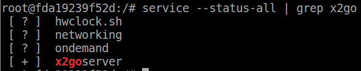
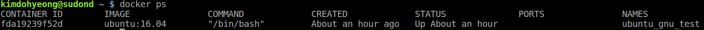
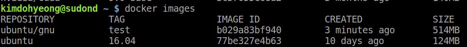

# X2GOCLINT 설치 하는 과정

## X2GO
 x2go는 원격 데스크탑 소프트웨어 오픈소스이다.<br>
 x2go는 Linux 시스템에 GUI를 접근하는 것이 가능하도록 해준다.<br>
 docker는 기본적으로 gui환경이 제공이 되지 않는다.<br>
 따라서 docker 내에서 gui를 사용하려면 docker 내부에 x2goclient를 설치하여 gui를 사용할 수 있다.


 ### 1. docker를 이용하여 container 만들기

 x2goclient를 설치하기 위해서 가장 기본적인 ubuntu:16.04버전의 이미지를 가지고 진행을 한다.

 ```
 $ docker run -it --name ubuntu_gnu_test ubuntu:16.04
 ```

 *<center> ubuntu:16.04 image를 이용한 container 생성 명령어 </center>*<br>

 * -it : STKIN 표준 입출력을 열고 가상 tty(pseudo-TTY)를 통해 접속하겠다는 의미
 * --name : 생성되는 container의 이름을 만든다
 * ubuntu:16.04 : 이미지를 선택한다. 참고로 <이미지이름>:<태그>이다.

<br>

### 2. X2Go server 설치하기

```Bash
apt-get update
apt-get install software-properties-common
add-apt-repository ppa:x2go/stable
# x2go ppa를 원격 ubuntu 서버에 추가한다.
apt-get update
# 해당 패키지를 update하기 위해 진행하는 과정
```
*<center> container 내부에서 진행되는 코드 </center>*<br>

>software-properties-common : <br>
>>This software provides an abstraction of the used apt repositories. It allows you to easily manage your distribution and independent software vendor software sources.<br>
it provides some useful scripts for adding and removing PPAs:
* PPA : Personal Package Archives(개인 패키지 저장소)
  <br><br><br>

마지막으로 x2go server를 설치하기 위해서는 x2goserver와 x2goserver-xsession을 설치해야 한다.

```Bash
apt-get install x2goserver x2goseerver-xsession 
```
*<center> container 내부에서 진행되는 코드 </center>*<br>

x2goclient server가 잘 동작하는지 확인하기 위해서는 다음 코드를 실행시켜 확인 할 수 있다.

```bash
 service --status-all | grep x2go
 # service x2goserver start
 # server가 동작하지 않을 때 시작하는 방법이다.
```
*<center> container 내부에서 진행되는 코드 </center>*<br>



*<center> server 동작 확인 </center>*
**참고한 사이트**<br>
  
  * https://askubuntu.com/questions/524936/cant-add-ppax2go-stable/738823#738823
  * https://www.addictivetips.com/ubuntu-linux-tips/set-up-x2go-on-linux/
  * https://eungbean.github.io/2018/12/04/EOD-cannot-connect-to-X-server-0.0/
  * http://training.nectar.org.au/package07/sections/connectWithX2Go.html
  * https://wiki.x2go.org/doku.php/doc:installation:x2goserver (서버 설치 관련 페이지)

<br><br><br>
### 3. 새로운 image 생성 후 새로운 container 생성하기

docker를 사용하는 환경에서 x2goclient를 이용해 gui를 사용하기 위해서는 docker container를 생성할 때 몇개의 옵션을 주어야 한다.<br>
그렇기 때문에 지금까지 만들어놓은 container를 image로 만든 후, 해당 이미지를 이용하여 새로운 container를 생성한다.<br>
container를 생성할 때 옵션을 주어야 display가 가능하다.<br>

#### docker container를 이미지로 바꾸기

내가 만든 container가 켜져 있는 상태에서 새로운 터미널을 켠다(단축키 : ctrl + alt + t)

내가 만든 container의 정보를 확인해 볼 수 있다.
```Bash
docker ps
```

*<center> docker ps </center>*

* container의 정보를 확인하는 것은 local 터미널에서 진행.
* docker name을 보면 처음 container를 생성할 때 만든 name임을 알 수 있음.

이제 해당 container를 image로 바꾸는 과정을 진행한다.<br>
container가 켜져있는 **local terminal**에서 다음 명령어를 작성한다.

```bash
docker commit fda19239f52d ubuntu/gnu:test
```
*<center> local terminal에서 진행되는 code </center>*

* fda19239f52d : image로 만들기 위한 container의 아이디를 작성한다.
* ID를 작성할 때 4자까지만 작성해도 가능하다.
* ubuntu/gnu:test : container가 image로 만들어 질 때 해당 image의 이름을 설정한다.<br><br>

생성된 이미지를 확인하기 위해서는 다음과 같은 코드를 입력한다

```
docker images
```
*<center> local terminal에서 진행되는 code </center>*<br>


*<center> docker images의 정보 </center>*<br>

내가 만든 image를 이용해서 container를 만들기 위해서는 다음과 같은 옵션을 주고 생성한다.

```bash
docker run -it  \
> -v /tmp/.X11-unix:/tmp/.X11-unix \	
> -v /dev/snd:/dev/snd \
> -e DISPLAY=unix$DISPLAY \
ubuntu/gnu:test				
```
*<center> local terminal에서 진행되는 code </center>*<br>